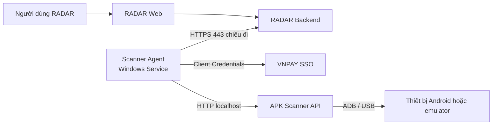

# VNPAY RADAR Scanner Agent

Worker biên chạy trên Windows dành cho VNPAY RADAR. Agent chủ động lấy các job quét APK từ
RADAR Backend, giao việc thực thi cho `apk-scan-api` cục bộ và gửi kết quả về qua HTTPS.

Phiên bản hiện tại hỗ trợ chạy một job tại một thời điểm và capability `TC-MOBI-3`.

## Mô hình triển khai



Máy Windows không cần IP public hoặc quy tắc firewall cho chiều kết nối vào. Agent chủ động
khởi tạo toàn bộ kết nối tới các dịch vụ từ xa.

## Thành phần

- **Scanner Agent**: worker chạy nền, thực hiện báo cáo trạng thái, nhận job, gia hạn lease,
  chạy quét và gửi kết quả.
- **Scanner Manager**: ứng dụng desktop Windows để cấu hình, quản lý service, chẩn đoán và xem log.
- **SQLite outbox**: hàng đợi bền vững cục bộ dành cho kết quả chưa gửi được. PostgreSQL của RADAR
  vẫn là nguồn dữ liệu chính thức.
- **Windows Service wrapper**: WinSW chạy Agent dưới tài khoản `LocalSystem`, tự động khởi động
  có độ trễ và tự khởi động lại khi gặp lỗi.

## Bắt đầu nhanh

### Cài đặt bằng bộ Setup

1. Khởi động APK Scanner cục bộ tại `http://127.0.0.1:8000`.
2. Kết nối thiết bị Android đã được cấp quyền hoặc khởi động emulator.
3. Chạy `VNPAYRadarScannerAgent-Setup-<version>-x64.exe` với quyền Administrator.
4. Mở **RADAR Scanner Manager** và nhập các giá trị phù hợp với môi trường.
5. Chọn **Install / upgrade**, sau đó chạy toàn bộ kiểm tra trong tab **Diagnostics**.

Xem [Hướng dẫn cài đặt](docs/installation.md) để biết các điều kiện tiên quyết, cấu hình
Keycloak, chế độ portable, quy trình nâng cấp và gỡ cài đặt.

### Chạy từ mã nguồn

```powershell
Copy-Item .env.example .env
# Thiết lập RADAR_AGENT_CLIENT_SECRET trong .env trước khi chạy.
uv sync --group dev
uv run radar-scanner-agent
```

Không commit `.env`, file DPAPI, cơ sở dữ liệu SQLite, log hoặc artifact được sinh ra khi build.

## Cấu hình định danh bắt buộc

Tích hợp mặc định trên môi trường test sử dụng một service account Keycloak riêng:

- Client ID: `vnpay-radar-agent`
- Loại client: confidential
- Service accounts: bật
- Standard Flow, Implicit Flow và Direct Access Grants: tắt
- Client role gán cho chính service-account user của client: `scanner-agent`

Agent không cần role partner, SPI hoặc HR-sync của VNPAY SSO.

## Tài liệu

- [Kiến trúc và vòng đời job](docs/architecture.md)
- [Cài đặt và nâng cấp](docs/installation.md)
- [Tham chiếu cấu hình](docs/configuration.md)
- [Vận hành và xử lý sự cố](docs/operations.md)
- [Phát triển và phát hành](docs/development.md)

## Kiểm tra khi phát triển

```powershell
uv sync --group dev
uv run ruff check src tests
uv run pytest -q
```

Build bộ Setup cho Windows và file ZIP portable:

```powershell
.\packaging\build.ps1
```

Artifact được ghi vào `packaging/output/`. Artifact dành cho phát triển hiện chưa được ký số;
bản phát hành production phải được ký Authenticode trong CI.

## Dự án liên quan

Backend API, database migration, giao diện quản lý scanner job và các quy tắc phân quyền thuộc
trách nhiệm của
[`vnpay-radar-platform`](https://git.vnpay.vn/ansp/application-security/vnpay-radar-platform).
Các thay đổi ở Agent và Backend phải được kiểm thử contract cùng nhau trước khi phát hành.
