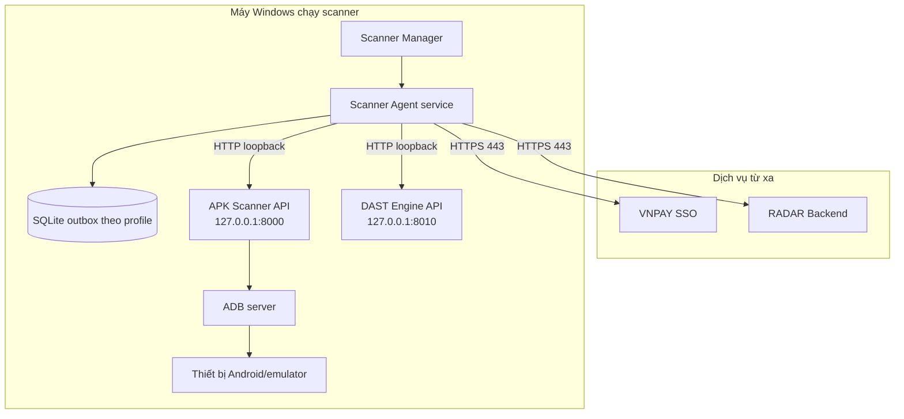
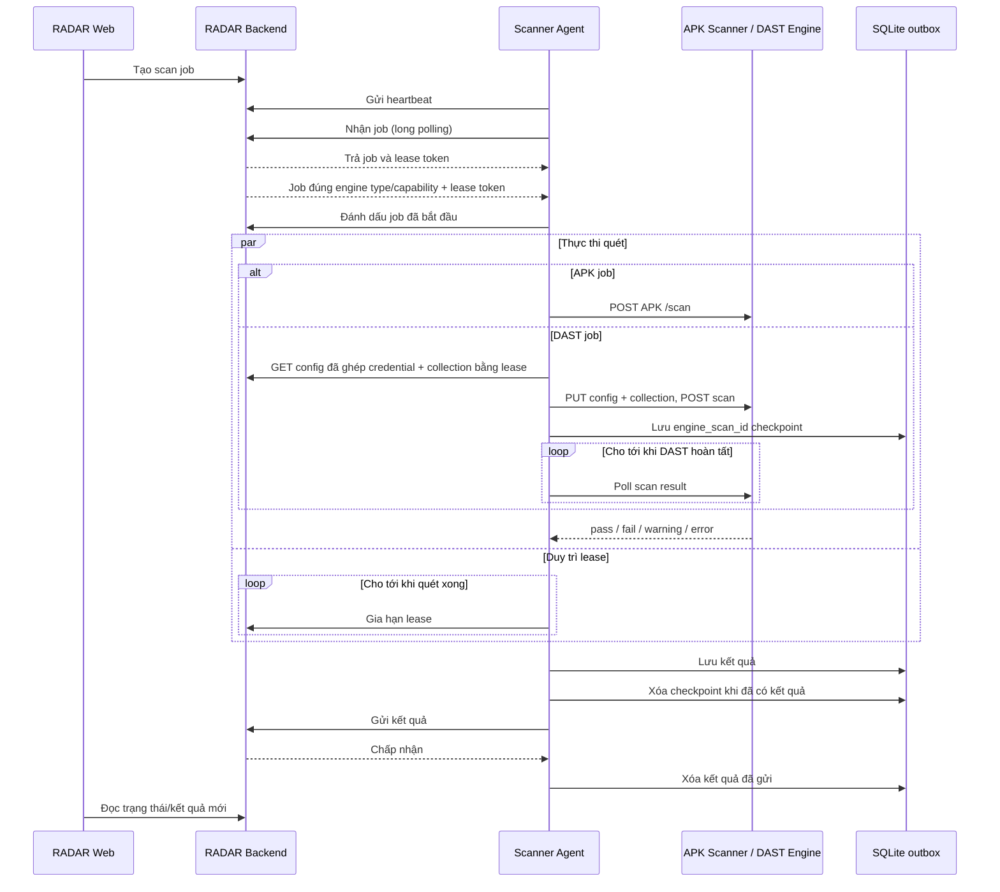

# Kiến trúc

## Mục đích

Scanner Agent kết nối RADAR với APK Scanner và DAST Engine chạy trên máy Windows trong mạng nội
bộ. Kiến trúc này không yêu cầu mở ADB, engine API hoặc máy
Windows cho lưu lượng mạng chiều vào.

Agent là một worker thực thi. Agent không quản lý người dùng, định nghĩa bài quét, lịch sử job,
phân quyền hoặc báo cáo. Các chức năng này vẫn thuộc `vnpay-radar-platform`.

## Thành phần

| Thành phần | Trách nhiệm |
| --- | --- |
| RADAR Web | Tạo và hiển thị scanner job. Web không bao giờ kết nối trực tiếp tới Agent. |
| RADAR Backend | Quản lý job, lease, phân quyền, kết quả và dữ liệu báo cáo lâu dài. |
| VNPAY SSO | Cấp access token ngắn hạn của service account cho Agent. |
| Scanner Agent | Chủ động lấy việc, điều phối thực thi, gia hạn lease và gửi kết quả. |
| APK Scanner API | Thực thi testcase trên môi trường Android cục bộ. |
| DAST Engine API | Thực thi testcase API đối với đích chỉ truy cập được từ mạng nội bộ. |
| Thiết bị Android/emulator | Chạy package Android mục tiêu. |
| Profile môi trường | Chọn một RADAR origin đang hoạt động: Development, UAT hoặc Custom. |
| SQLite outbox | Lưu kết quả đã hoàn thành theo từng profile cho tới khi đúng RADAR origin chấp nhận. |

## Ranh giới mạng và tin cậy

Kết nối bắt buộc:

| Chiều kết nối | Đích | Mục đích |
| --- | --- | --- |
| Đi ra ngoài | VNPAY SSO token endpoint, HTTPS 443 | Lấy token bằng Client Credentials |
| Đi ra ngoài | RADAR Backend, HTTPS 443 | Gọi API heartbeat, claim, lease và result |
| Localhost | APK Scanner API, mặc định HTTP 8000 | Kiểm tra health, trạng thái thiết bị và thực thi quét |
| Localhost | DAST Engine API, mặc định HTTP 8010 | Đồng bộ config/collection và thực thi DAST |
| Cục bộ | ADB và USB | APK Scanner điều khiển thiết bị |

Không mở cổng APK Scanner `8000` hoặc cổng ADB `5037` ra Internet.
Không mở cổng DAST Engine `8010` ra mạng; chỉ Scanner Agent được gọi qua loopback.

Khi bật DAST, một Windows Service chạy hai logical agent có ID riêng. Worker APK và DAST gửi
heartbeat/claim độc lập nhưng dùng chung VNPAY SSO service account. API key của engine được mã
hóa bằng DPAPI. Principal credential được RADAR lưu mã hóa theo project và chỉ cấp trong config
sau khi xác minh lease của đúng DAST job.

## Vòng đời job

Worker chạy hai vòng lặp độc lập:

1. Vòng heartbeat đọc trạng thái scanner/thiết bị và gửi về RADAR mỗi
   `RADAR_AGENT_HEARTBEAT_INTERVAL_SECONDS`, kể cả khi một bài quét đang chạy.
2. Vòng worker gửi các kết quả còn tồn trong outbox rồi long-poll để nhận một job.
3. Worker khởi động job đã nhận và gia hạn lease ở background.
4. Worker thực thi testcase qua scanner cục bộ.
5. Worker lưu kết quả vào SQLite trước khi gửi tới RADAR.

Với DAST, Agent lưu thêm cặp `job_id -> project_id + engine_scan_id`. Nếu cùng máy Agent restart
trong lúc Engine còn giữ scan record, worker claim lại job sau khi lease cũ hết hạn, đọc checkpoint
và tiếp tục poll thay vì tạo một scan mới. Worker trên máy khác không có checkpoint cục bộ. Nếu
Engine đã restart và trả `404`, checkpoint bị xóa và Agent đồng bộ material rồi chạy lại job.

DAST config/collection luôn được lấy lại sau khi claim, vì vậy job sử dụng material mới nhất của
project tại thời điểm thực thi. Riêng request testcase nằm trong job là snapshot tại thời điểm
enqueue để đảm bảo audit được payload đã chạy.

Thứ tự này ưu tiên độ bền của kết quả hơn việc nhận job mới. Nếu RADAR không khả dụng khi
outbox đang có dữ liệu chờ, Agent sẽ thử gửi lại trước khi nhận thêm job. Vòng worker chỉ bắt
đầu sau khi Backend chấp nhận heartbeat đầu tiên.

## Xác thực và phân quyền

Agent sử dụng OAuth 2.0 Client Credentials với confidential client `vnpay-radar-agent`.
Access token có thời hạn ngắn và được cache trong bộ nhớ. Khi một request nhận
`401 Unauthorized`, Agent làm mới token một lần và thử lại một lần.

RADAR chỉ chấp nhận các endpoint dành cho Agent khi token chứa client role `scanner-agent`.
Client secret được bảo vệ bằng Windows DPAPI và không bao giờ được đưa vào heartbeat, kết quả
job hoặc log.

## Cơ chế lease và outbox

- Phản hồi claim chứa job, lease token và thời hạn lease.
- Agent gia hạn lease theo `RADAR_AGENT_LEASE_RENEW_INTERVAL_SECONDS`.
- Payload kết quả được insert hoặc replace theo `job_id` trong SQLite outbox.
- Một dòng outbox chỉ bị xóa sau khi RADAR Result API chấp nhận dữ liệu.
- Mỗi database ghi metadata RADAR origin khi mở lần đầu và từ chối chạy nếu file đã thuộc origin
  khác. Outbox legacy còn dữ liệu được coi là DEV cho tới khi gửi hết.
- Chỉ một profile hoạt động tại một thời điểm; việc đổi profile không di chuyển hoặc gộp dữ liệu.
- SQLite không thay thế PostgreSQL của RADAR và không được dùng để lập báo cáo.

## Khả năng và giới hạn hiện tại

- Capability được lấy động từ `GET /testcases` của APK Scanner. Bản hiện tại hỗ trợ
  `TC-MOBI-2`, `TC-MOBI-3`, `TC-MOBI-4`, `TC-MOBI-12`, `TC-MOBI-13`.
- Heartbeat báo readiness riêng cho từng testcase; USB, thiết bị chính và emulator được đánh giá
  độc lập. `TC-MOBI-13` không yêu cầu USB ADB phải online từ trước: khi `adbhide` đang bật,
  Agent có thể điều khiển qua Wi-Fi và APK Scanner tự kiểm tra cáp rồi chuyển sang USB. Với
  Scanner API cũ chưa trả trạng thái cáp, Agent chỉ precheck có USB hoặc Wi-Fi đang online.
- Mức đồng thời: một job cho mỗi logical worker.
- Khi bật DAST, APK worker và DAST worker là hai task độc lập nên có thể chạy đồng thời; mỗi worker
  vẫn chỉ xử lý một job.
- Không chạy worker trực tiếp và Windows Service cùng lúc trên một máy.
- Yêu cầu hủy job từ RADAR được ghi nhận khi gia hạn lease, nhưng request đang chạy tới scanner
  hiện chưa bị ngắt.
- Agent chưa upload file evidence riêng. Phản hồi có cấu trúc của APK/DAST Engine được gửi trong
  result payload; evidence file lớn cần contract presigned URL riêng trong phiên bản sau.
- Trạng thái APK Scanner, kết nối thiết bị và readiness từng testcase được báo cáo độc lập trong
  mỗi heartbeat.

Mọi capability testcase mới đều cần thay đổi đồng bộ ở APK Scanner, ánh xạ payload của Agent,
validation của RADAR Backend, giao diện và contract test.
